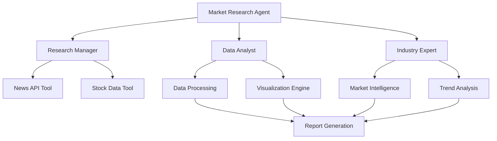

# 🚀 Market Research Agent - AI-Powered Market Intelligence Platform

> **Automated market research and analysis using CrewAI multi-agent systems**

[](https://www.python.org/)
[](https://github.com/joaomdmoura/crewai)
[](https://langchain.com/)
[](LICENSE)

## 📋 Table of Contents
- [Overview](#-overview)
- [Key Features](#-key-features)
- [Architecture](#-architecture)
- [Tech Stack](#-tech-stack)
- [Installation](#-installation)
- [Configuration](#-configuration)
- [Usage](#-usage)
- [Project Structure](#-project-structure)
- [API Documentation](#-api-documentation)
- [Contributing](#-contributing)
- [License](#-license)

## 🎯 Overview

**Market Research Agent** is an intelligent automation platform that leverages **multi-agent AI systems** to conduct comprehensive market research. Built with **CrewAI**, this project demonstrates advanced AI orchestration, real-time data processing, and automated report generation capabilities.

### 🎪 What Makes This Special?

- **🤖 Multi-Agent Architecture**: Specialized AI agents working collaboratively
- **📊 Real-Time Data Integration**: Live market data from multiple sources
- **🔍 Intelligent Analysis**: Advanced pattern recognition and trend identification  
- **📈 Interactive Visualizations**: Dynamic charts and graphs with Plotly
- **⚡ Production-Ready**: Robust error handling and logging
- **🔧 Modular Design**: Clean, maintainable, and extensible codebase

## ✨ Key Features

### 🎭 **Intelligent Agent System**
- **Research Manager**: Orchestrates the entire research workflow
- **Data Analyst**: Processes and analyzes market data with statistical insights
- **Industry Expert**: Provides contextual market intelligence and trend interpretation

### 📡 **Multi-Source Data Integration**
- **📰 News API**: Real-time market news and sentiment analysis
- **📈 Yahoo Finance**: Historical and live stock market data
- **🔄 Extensible**: Easy integration of additional data sources

### 🎨 **Advanced Analytics & Visualization**
- **📊 Interactive Charts**: Candlestick charts, trend analysis
- **📈 Statistical Analysis**: Moving averages, volatility metrics
- **🎯 Pattern Recognition**: Market trend identification
- **📋 Automated Reports**: JSON-formatted comprehensive insights

### 🛡️ **Enterprise-Grade Features**
- **🔐 Secure API Management**: Environment-based configuration
- **📝 Comprehensive Logging**: Detailed operation tracking
- **⚠️ Robust Error Handling**: Graceful failure management
- **💾 Data Persistence**: Efficient report storage and retrieval

## 🏗️ Architecture



## 🛠️ Tech Stack

### **Core Technologies**
- **🐍 Python 3.9+**: Primary programming language
- **🤖 CrewAI**: Multi-agent AI orchestration framework
- **🔗 LangChain**: AI application development framework
- **🧠 Google Gemini API**: Advanced language model integration

### **Data & Analytics**
- **🐼 Pandas**: Data manipulation and analysis
- **📊 Plotly**: Interactive data visualization
- **📈 Matplotlib**: Statistical plotting
- **💹 yFinance**: Financial data retrieval

### **Infrastructure**
- **🔧 python-dotenv**: Environment configuration
- **📰 NewsAPI**: Real-time news data
- **📝 JSON**: Data serialization and storage

## 🚀 Installation

### **Prerequisites**
- Python 3.9 or higher
- pip package manager
- Valid API keys (Google Gemini, NewsAPI)

### **Quick Start**

```bash
# Clone the repository
git clone https://github.com/yourusername/market-research-agent.git
cd market-research-agent

# Create virtual environment
python -m venv venv
source venv/bin/activate  # On Windows: venv\Scripts\activate

# Install dependencies
pip install -r requirements.txt

# Set up environment variables
cp .env.example .env
# Edit .env with your API keys
```

## ⚙️ Configuration

Create a `.env` file in the project root:

```env
# Required API Keys
GOOGLE_API_KEY=your_google_gemini_api_key
NEWS_API_KEY=your_newsapi_key

# Optional Configuration
LOG_LEVEL=INFO
REPORT_FORMAT=json
MAX_NEWS_ARTICLES=10
STOCK_DATA_PERIOD=1mo
```

### **API Key Setup Guide**

1. **Google Gemini API**: Visit [Google AI Studio](https://makersuite.google.com/app/apikey)
2. **NewsAPI**: Register at [NewsAPI.org](https://newsapi.org/register)

## 🎮 Usage

### **Basic Usage**

```bash
# Run the market research automation
python market_research.py
```

### **Advanced Usage**

```python
from market_research import MarketResearchAgent

# Initialize the agent
agent = MarketResearchAgent()

# Run research for specific company
result = agent.research_company("AAPL")

# Generate comprehensive report
report = agent.generate_report(result)
```

### **Example Output**

The system generates comprehensive reports including:
- 📊 Market sentiment analysis
- 📈 Stock performance metrics
- 📰 Recent news impact assessment
- 🎯 Trend predictions and insights

## 📁 Project Structure

```
Market Research Agent/
├── 📁 agents/                    # AI Agent Definitions
│   └── research_agents.py        # Specialized agent classes
├── 📁 tools/                     # Data Collection Tools
│   └── market_tools.py           # API integration tools
├── 📁 utils/                     # Utility Functions
│   └── helpers.py                # Data processing utilities
├── 📁 .vscode/                   # IDE Configuration
│   └── settings.json             # VS Code settings
├── 📄 market_research.py         # Main Application Entry Point
├── 📄 requirements.txt           # Python Dependencies
├── 📄 README.md                  # Project Documentation
├── 📄 DEVELOPMENT_LOG.md         # Development History
└── 📄 .env                       # Environment Configuration
```

## 📖 API Documentation

### **ResearchAgents Class**

```python
class ResearchAgents:
    def create_research_manager() -> Agent
    def create_data_analyst() -> Agent  
    def create_industry_expert() -> Agent
```

### **MarketTools Class**

```python
class MarketTools:
    def get_market_news(query: str, days: int = 7) -> List[Dict]
    def get_stock_data(symbol: str, period: str = "1mo") -> pd.DataFrame
    def create_tools() -> List[Tool]
```

### **Helper Functions**

```python
def process_news_data(articles: List[Dict]) -> pd.DataFrame
def create_stock_plot(data: pd.DataFrame, symbol: str) -> str
def save_report(data: Dict, filename: str) -> None
def load_report(filename: str) -> Dict
```

## 🤝 Contributing

Contributions are welcome! Here's how you can help:

1. **🍴 Fork** the repository
2. **🌟 Create** a feature branch (`git checkout -b feature/AmazingFeature`)
3. **💾 Commit** your changes (`git commit -m 'Add some AmazingFeature'`)
4. **📤 Push** to the branch (`git push origin feature/AmazingFeature`)
5. **🔄 Open** a Pull Request

### **Development Guidelines**
- Follow PEP 8 style guidelines
- Add comprehensive docstrings
- Include unit tests for new features
- Update documentation as needed

## 📄 License

This project is licensed under the MIT License - see the [LICENSE](LICENSE) file for details.

## 🙏 Acknowledgments

- **CrewAI Team** for the amazing multi-agent framework
- **LangChain** for AI application development tools
- **NewsAPI & Yahoo Finance** for providing reliable data sources

## 📞 Contact & Support

**Developer**: [Md.Bayzid Hossain]  
**Email**: [hossainbayzid011@gmail.com]  
**LinkedIn**: [www.linkedin.com/in/bayzid-hossain-79a9752a7]  
**Portfolio**: []

---

⭐ **If you found this project helpful, please give it a star!** ⭐

*Built with ❤️ and cutting-edge AI technology*
